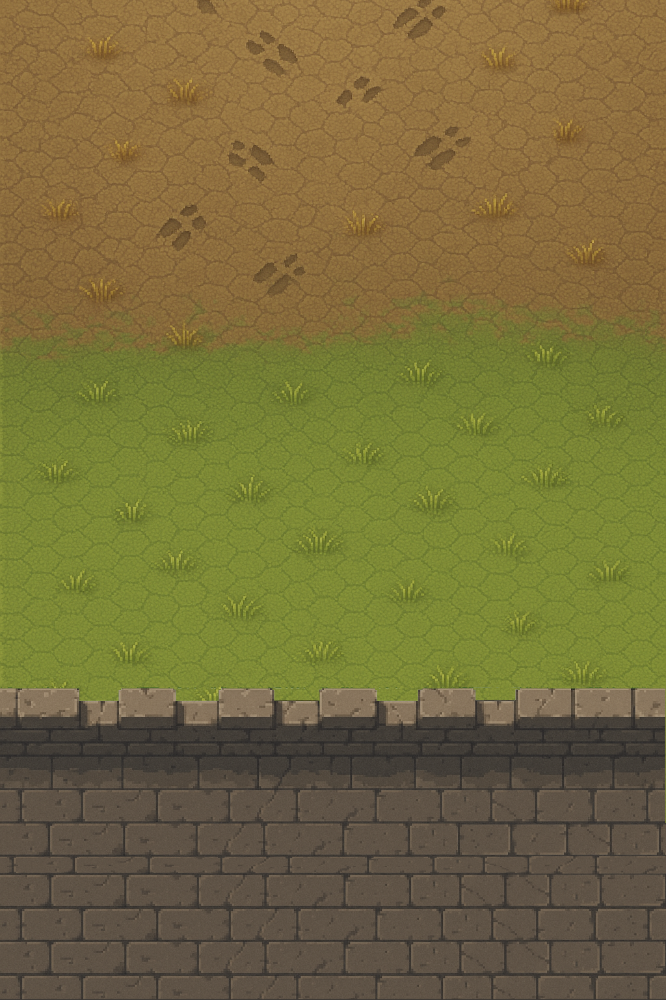
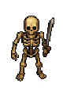
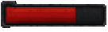
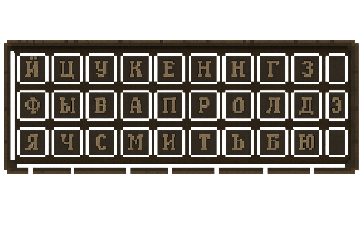

# 2D Игра — Magic Type

## 1. Общая концепция

Проект — **тренажёр печати** в сеттинге средневекового фентези, совмещённый с динамикой аркадного геймплея.
Основной вид — **сверху (опционально)**.
Дизайн стиль — **пиксель арт**.

## 2. Геймплей

Игрок управляет аватаром, находящимся **в нижней части экрана**.  
Сверху появляются **волны противников**, движущихся к игроку со скоростью, зависящей от их типа.
Алгоритм появления противника задается **сценарием уровня**.
Над каждым противнике отображается **имя противника** - слово из **словаря приложения**.
**Длина слова** определяет запас здоровья противника. Ввод имени противника уменьшает его здоровье. Полный ввод соответствует уничтожению противника, либо его переходу в новую фазу.
**Ограничение:** одновременно на экране НЕ может быть несколько слов, начинающихся с одной буквы.

**Условие победы:** уничтожить все волны противников, не потеряв все здоровье.  
**Условия поражения:** потеря всего здоровья.

---

## 2. Основные параметры

| Параметр             | Значение                                         |
| -------------------- | ------------------------------------------------ |
| Платформа            | ПК и мобильные устройства                        |
| Размер игрового поля | 720×480 пикселей                                 |
| Технология           | Vanilla Canvas                                   |
| Управление           | Клавиатура (виртуальная клавиатура на мобильных) |
| Механика атаки       | Ввод имени противника с клавиатуры               |
| Дополнительные атаки | Ввод названия заклинания с клавиатуры            |

---

## 3. Механика ввода

Для уничтожения противника игрок должен **ввести его имя**.  
После начала ввода:

- Фокус атаки фиксируется на выбранном противнике.
- Переключение на другого противника невозможно до завершения ввода.
- После полного ввода имени противник уничтожается.

---

## 4. Игрок

**Позиция:** нижняя часть экрана.

**Типы атак игрока:**

- **Дальний бой:**  
  Фаерболл (смертельный проджектайл), вылетает **только после полного ввода имени противника**.
- **Ближний бой:**
  - Срабатывает при вводе **каждого символа**, если противник находится в радиусе ближнего боя.
  - Каждая атака **оглушает противника** на короткое время, что дает шанс не получить урон, если противник приблизится.
  - Некоторые противники имеют **защиту от оглушения или полный иммунитет**.

---

## 5. Противники

Противники появляются сверху и движутся по направлению к игроку.  
Каждый несёт слово, длина которого отражает запас здоровья.
Движение противников — **по прямой и по диагонали** (ограничение дизайна спрайтов).

| Тип                        | Особенности                                                                                                   |
| -------------------------- | ------------------------------------------------------------------------------------------------------------- |
| **Миньон**                 | Средняя скорость и здоровье, ближний бой.                                                                     |
| **Колдун**                 | Низкое здоровье, средняя скорость, дальняя атака с дистанции.                                                 |
| **Мини-босс (Барабанщик)** | Высокое здоровье, низкая скорость, ускоряет ближайших противников.                                            |
| **Босс**                   | Появляется в конце уровня; имеет большое здоровье и уникальные способности (логика разрабатывается отдельно). |

---

## 6. Очки и комбо

- За уничтожение противников игрок получает **очки опыта**.
- **Множитель комбо** увеличивается при безошибочном вводе.
- При ошибке комбо **сбрасывается**.
- Множитель комбо влияет на количество получаемого опыта.

---

## 7. Мобильная версия

- Внизу экрана появляется **виртуальная клавиатура**.
- Высота игрового поля уменьшается на высоту клавиатуры.
- Скорость противников **уменьшается пропорционально** уменьшению игрового поля.

---

## 9. Примеры ассетов

| Параметр                                      | Значение                                                                   |
| --------------------------------------------- | -------------------------------------------------------------------------- |
| Пример игрового кадра                         |                  |
| Бэкграунд                                     |                    |
| Бэкграунд при активной виртуальной клавиатуре |  |
| Пример персонажа игрока                       |          |
| Пример противника ближнего боя                |                                  |
| Пример противника дальнего боя                |                        |
| Пример шкалы здоровья                         |                              |
| Пример виртуальной клавиатуры                 |                  |

---

## 9. Дополнительно

- Возможен **выбор языка** словаря для слов противников.
-
